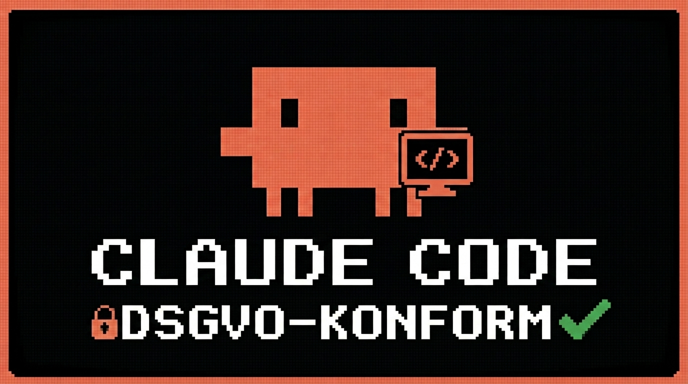

# claude-code-eu



GDPR-compliant Claude Code starter kit — AI-powered code analysis running entirely within Europe or locally on your machine.

🇩🇪 [Deutsche Version](README.de.md)

---

## What is this?

Claude Code routes requests through Anthropic's US-based servers by default. This kit shows how to run Claude Code through **GDPR-compliant providers** — with Data Processing Agreements, EU data residency, or fully local processing.

## Supported Providers

| Provider | Data Center | GDPR | Cost |
|---|---|---|---|
| AWS Bedrock | Frankfurt (eu-central-1) | ✓ DPA available | Pay-per-use |
| Azure OpenAI via LiteLLM | EU regions available | ✓ DPA available | Pay-per-use |
| Groq via LiteLLM | EU infrastructure | ✓ DPA available | Freemium |
| Ollama (local) | Your machine | ✓ No data transfer | Free |
| Ollama (self-hosted) | Your server | ✓ Full control | Infrastructure costs |

## Quick Start

```bash
# 1. Install dependencies
npm install

# 2. Launch interactive provider switcher
npm run setup

# 3. Start Claude Code
claude
```

## Switching Providers

```bash
npm run setup
```

The interactive CLI lists all providers with requirements and prints setup instructions after selection.

Alternatively, switch manually:
```bash
cp .claude/settings.aws-bedrock.json .claude/settings.json
```

## AWS Bedrock (Frankfurt)

1. Set up an AWS account with Bedrock access in `eu-central-1`
2. Activate model access for `anthropic.claude-sonnet-4-6-20250514-v1:0`
3. Set credentials:

```bash
export AWS_ACCESS_KEY_ID=...
export AWS_SECRET_ACCESS_KEY=...
npm run setup  # select option 1
```

## Azure OpenAI via LiteLLM

1. Deploy Azure OpenAI in an EU region (e.g. `swedencentral`, `francecentral`)
2. Set credentials:

```bash
cp setenv-azure.example.sh setenv-azure.sh
# edit setenv-azure.sh
source setenv-azure.sh
```

3. Start LiteLLM proxy:

```bash
pip install litellm
litellm --config litellm/config.yaml
```

4. Select provider: `npm run setup` → option 2

## Groq via LiteLLM

1. Create API key: https://console.groq.com/keys
2. Set credentials:

```bash
cp setenv-groq.example.sh setenv-groq.sh
# edit setenv-groq.sh
source setenv-groq.sh
```

3. Start LiteLLM proxy:

```bash
litellm --config litellm/config.yaml
```

4. Select provider: `npm run setup` → option 3

## Ollama (local)

```bash
# Install Ollama: https://ollama.com
ollama pull llama4
ollama serve

npm run setup  # select option 4
```

## Demo: Code Review with Claude

```bash
# Analyze the demo app (contains intentional security issues)
cat prompt.txt | claude
```

Or directly inside Claude Code:
```
> Analyze app.js for security issues
```

## Demo App (`app.js`)

The included Express app is a simple user management API with **intentional security flaws** — as a test case for code review:

- Passwords logged in plaintext
- Hardcoded secret key in source code
- Missing input validation (broken array access)
- CORS open for all origins
- Server runs on `0.0.0.0` without auth middleware

## GDPR Note

This kit covers only the **technical infrastructure aspect** of GDPR compliance. Full compliance additionally requires:

- Signed Data Processing Agreements (DPA) with each provider
- Processing registry entries for AI-assisted workflows
- Data Protection Impact Assessment (DPIA) for high-risk processing
- Involvement of your Data Protection Officer

---

Inspired by [claude-code-dsgvo](https://github.com/require-gio/claude-code-dsgvo) — independent reimplementation with Node.js, interactive CLI, and Groq support.

---

> **Legal Disclaimer:** This repository is a technical guide only and does not constitute legal advice. GDPR compliance depends on your specific use case, data types, and jurisdiction. For binding legal assessment, consult a qualified data protection attorney or your Data Protection Officer.
